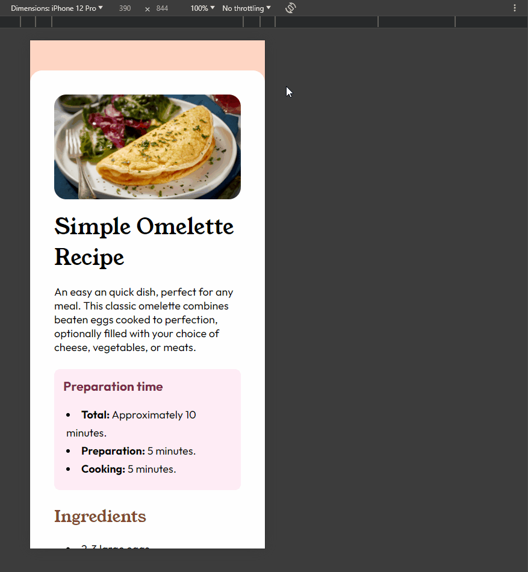

# Frontend Mentor - Solução de uma Página de receita

Essa é uma solução do desafio: [Recipe page challenge on Frontend Mentor](https://www.frontendmentor.io/challenges/recipe-page-KiTsR8QQKm).

## Tabela de conteúdos

- [Visão Geral](#visão-geral)
    - [Desafio](#desafio)
    - [Screenshot](#screenshot)
    - [Link](#link)
- [Meu Processo](#meu-processo)
    - [Ferramentas usadas](#ferramentas-usadas)
    - [O que eu aprendi?](#o-que-eu-aprendi)
    - [Recursos úteis](#recursos-úteis)
- [Autor](#autor)
- [Reconhecimento](#reconhecimento)    

## Visão Geral

### Desafio
O desafio era criar uma Landing Page sobre uma receita culinária. Para isso, sendo necessário uso do conhecimento sobre HTML e CSS.
Fazendo uso de conceitos básicos sobre HTML, como a criação de títulos, classes, listas e tabelas; e em como organiza-las corretamente. O mais desafiador foi na criação do CSS, onde foi necessário, não só a estilização de fontes e cores, mas como também o uso de Flexbox, estilização de containers e responsividade para Mobile
### Screenshot

Gif da página em um computador:

Gif da página em um mobile:

### Link

## Meu processo

### Ferramentas usadas
 
- Semântica HTML5
- Customização CSS3
    - edição fonte e coloração
    - edição de caixas/containers
    - Flexbox
    - Responsividade

### O que eu aprendi?

Aprendi a melhor utilizar o Flexblox, em como customizar container e posiciona-los. Além disso, também consegui entender melhor como funciona um código Responsivo
### Recursos úteis

Utilização do site [W3School](https://www.w3schools.com) para melhor entender recursos de CSS

Utilização do site [Unsplash](https://unsplash.com/pt-br) para buscar imagem utilizada
## Autor

Link das minhas redes sociais:

[LinkedIn](https://www.linkedin.com/in/victor-fgarcia)

[GitHub](https://github.com/VFGarciaDev)

## Reconhecimento

Devo agradecer ao curso [Dev. Quest - Dev. em dobro](https://www.linkedin.com/school/devquest-dev-em-dobro/) e aos professores e irmãos, Beto e Cadu, por suas aulas e excelentes dicas!!